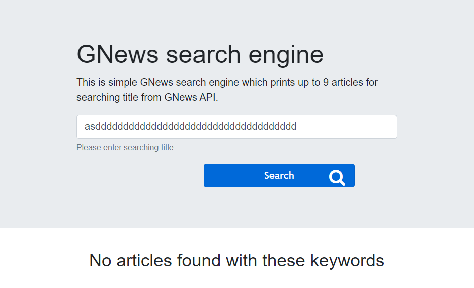
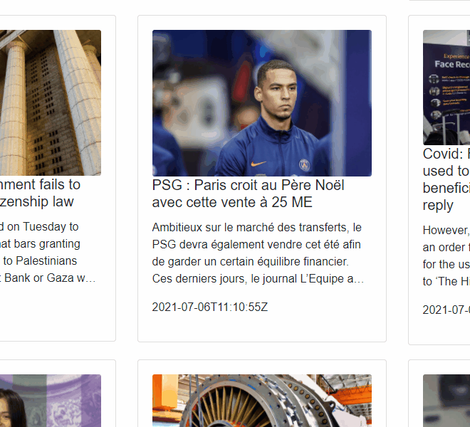

# GNews-wepsite

This is simple gnews search engine which prints up to 9 searching artilces from GNews API and lists them below searching bar. 

## Getting started with GNews-website

In order to set up project you have to install all the dependancies by running command below in both client and server directories (client will still work if server is not running since server part only logs searched keywords and clicked articles' info):

### `npm install`

Installs the dependancies in local node_modules folder required for a project.

### `npm start`

Runs the app in the development mode.\
Open [http://localhost:3000](http://localhost:3000) to view client side in the browser.

The page will reload if you make edits.\
You will also see any lint errors in the console.

## About this website

This website utilized React for a front end part, bootstrap for responsive design, axios for fetching data.  It is divided into 3 sections:
* Header 
* Articles
* Footer

### Header 

 **Desktop size**  

 **Mobile size**  

Header part contains:
* Title
* Description
* Form 
  * Search bar
  * Search button

When button is clicked it checks validation(described below) and if it passes then fetches up to 9 articles typed in search input area and stores them in local state. If input is not valid the error message occurs above input field.   

In addition, when article title does not match any results it prints message '*No article found with these keywords*'
<kbd>

<kbd/>
 
### Validation 

There are three things that are being validated:
1. Number of spaces is limited to 40  

2. Only alphanumeric characters are allowed  

3. Cannot be empty field  

### Articles

Main article part stores 3 articles in a row.
Article component is comprised of react bootstrap element - card component.
Each card contains image on the top, article title, description, date of publishing.
When article is clicked it opens original article in new tab.
When client server starts it loads articles and   

Here are hover effects:

